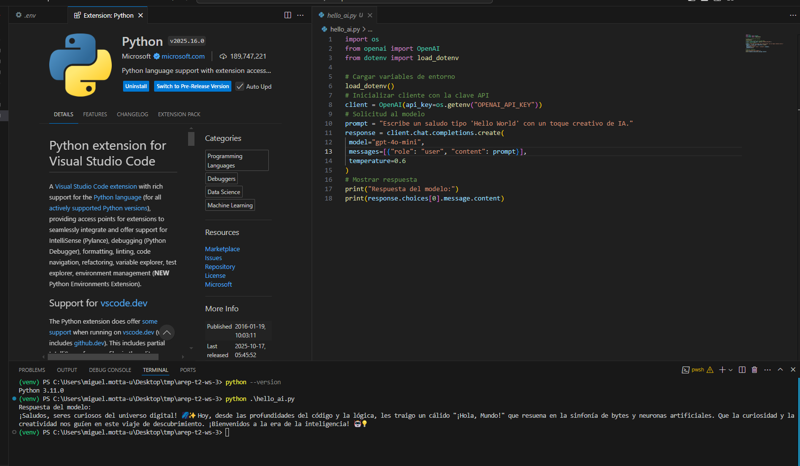
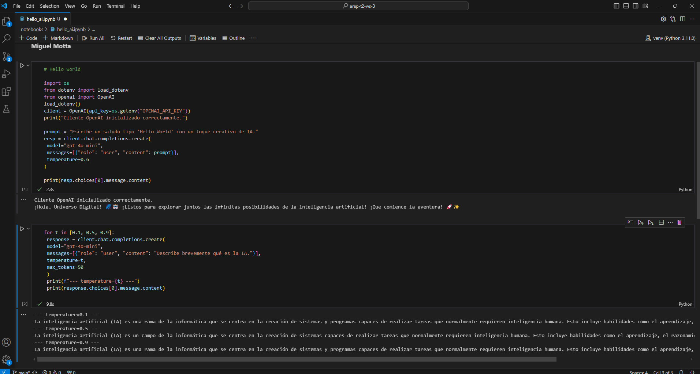
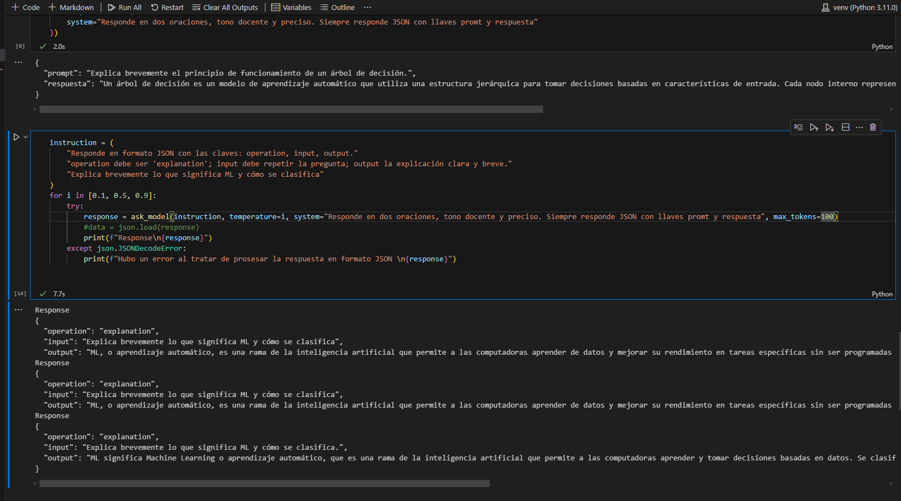

# arep-t2-ws-3  
**Getting Started with LLMs using Python and Jupyter Notebook**

### Requirements
- Python **3.10.x** or higher  
- **pip 22.3+**  
- A virtual environment manager such as **venv** or **conda**  
- An IDE such as **VS Code**, **PyCharm**, or any other of your choice  

---

### Hello World! – Getting Started with the OpenAI API
We can send prompts and receive responses using the official **OpenAI API** with a valid **API key**.  
It’s important to keep this key secret. To manage it securely, we use **dotenv** to load it as an environment variable:

You can experiment with different **temperature** values to explore the model’s creativity and variability.  

Note that the model may truncate responses once it reaches its **token limit**, but the output will still conform to the expected **JSON format**.

---

### Author
**Miguel Ángel Motta**
